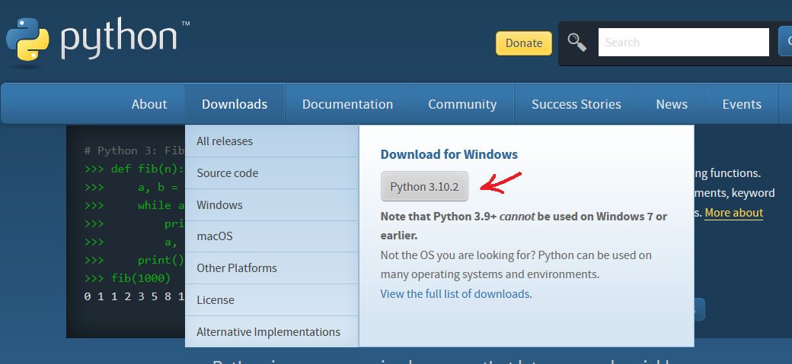
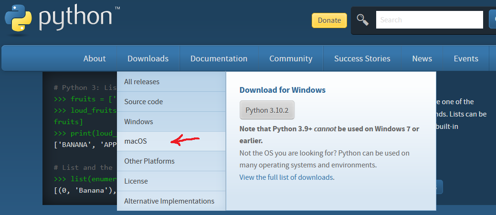
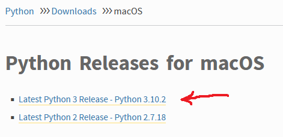
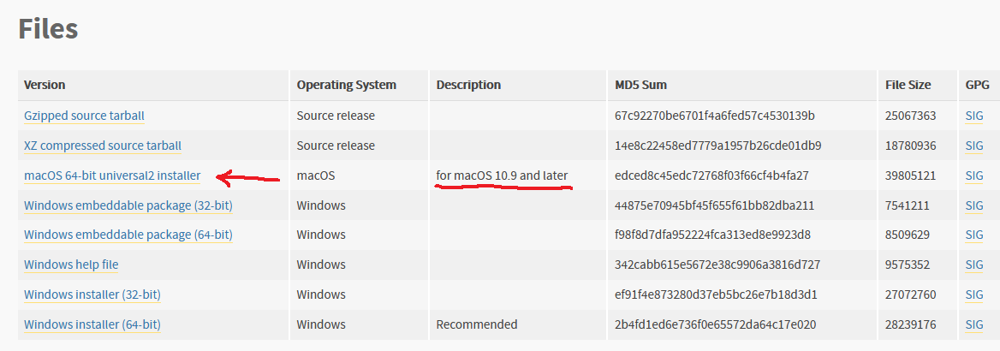
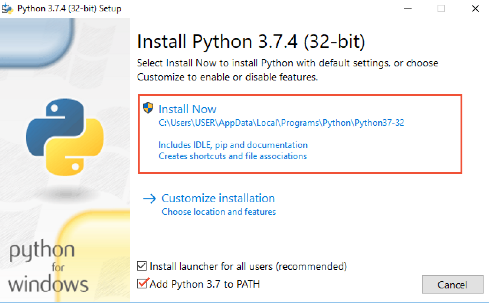

# Установка интерпретатора Python

1. Зайти на официальный сайт [python.org](https://www.python.org/)
2. Загрузите интерпретатор Python
    - Для Windows

    

    - Для Mac OS

    Выберите в списке операционных систем macOS
    

    Выберите версию интерпретатора (3.10.2)
    

    Выберите дистрибутив для macOS
    

3. Запустите установку Python

    Выберите установку с настройками по умолчанию, а также поставьте галочку напротив "Add Python 3.10 to PATH"
    

4. Проверьте корректность установки, выполнив следующие инструкции
    - Откройте консоль, нажав клавиши `Win`+`R`, введите `cmd` и нажмите `Enter` (для Windows)
    - Введите команду `python --version`
    - Убедитесь, что появилась надпись `Python 3.10.2`

5. Запустите консольный терминал Python, введя команду `python`
6. Экспериментируйте!
